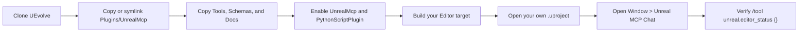

# UEvolve

**Unreal Editor MCP Self-Extension Workbench**

AI agents should read [AGENTS.md](AGENTS.md) first. It is the canonical handoff
for project structure, current self-extension workflow, RAG/tooling context,
safe edit rules, and the requirement to update `AGENTS.md` plus this `README.md`
after meaningful changes.

This repository is an Unreal Engine 5.7 editor-tooling workbench focused on editor automation, AI-assisted project inspection, Blueprint scaffolding, UMG setup, and local Model Context Protocol workflows.

Its main deliverable is the **Unreal MCP** editor plugin under `Plugins/UnrealMcp`. The plugin exposes Unreal Editor operations through a localhost MCP endpoint and an in-editor chat panel. The repository root includes `UEvolve.uproject` as the default local development host, while `Examples/UEvolveExample` remains an optional validation/demo project.

## 中文概览

本项目当前定位为 **面向 Unreal Editor 的 MCP 自扩展工作台**。

它不只是让 AI 调用 Unreal Editor 工具，而是尝试把“新增 MCP 能力”本身产品化：AI 可以在安全审计、dry run、备份、编译、测试、回滚、长期记忆和外部 supervisor 的保护下，为当前项目持续扩展新的编辑器自动化工具。

当前重点：

- 在 Unreal Editor 内运行本地 MCP server，并提供 `Window > Unreal MCP Chat` 对话入口。
- 通过 `Window > Unreal MCP Workbench` 提供轻量自扩展控制台，聚合状态、审计、核心测试、pipeline、lock 等能力。
- 支持项目检查、地图/资产查询、PIE 控制、日志读取、Map Check、Python/Console 执行等基础编辑器自动化。
- 支持 Blueprint 图编辑、UMG Widget 编辑、玩法系统脚手架、MCP 工具脚手架和项目本地 `.skill` 工作流。
- 自扩展链路包含 schema 校验、patch 片段校验、dry-run diff、备份 manifest、UBT 编译、测试套件、rollback、project memory 和 supervisor 重启恢复。
- Skill 蒸馏链路会记录高层 Editor/Chat/MCP 活动到本地 JSONL，并把一次任务/session 总结成可审查的 `SKILL.md` 草稿，确认后再 promote 到项目技能库。
- 引入多人协作保护：CODEOWNERS、工具命名规范、Manifest schema、extension session lock、ToolRegistry 风险元数据和冲突检测规则。
- 仓库根目录提供 `UEvolve.uproject` 作为统一的本地开发入口；`Examples/UEvolveExample` 只作为可选示例工程和本地测试资源。

## Current Status

The repository currently contains:

- `UEvolve.uproject`, the root Unreal Engine 5.7 local development host for the workbench.
- `open_uevolve.command`, a macOS convenience launcher that opens the root host project.
- `Plugins/UnrealMcp`, an editor plugin for local MCP and in-editor AI/chat workflows.
- `Examples/UEvolveExample`, an optional Unreal Engine 5.7 C++ example project used to validate the plugin with sample content.
- Git LFS setup for Unreal binary assets.
- Project-level README and ignore rules suitable for public GitHub hosting.
- Self-extension safety rails: schema validation, patch-fragment validation, dry-run diffs, backups, build/test handoff, rollback manifests, project memory, and project-local skills.
- Versioned core MCP test fixtures under `Tools/UnrealMcpTests`.
- Explicit ToolRegistry metadata under `Tools/UnrealMcpToolRegistry/tools.json` for category, handler alias, risk level, write/build/process/restart/memory/lock requirements, dry-run support, owner, docs path, and test coverage.
- Registry-derived ToolHandlerRegistry metadata so audit, dispatch, and validation share the same handler/category view without source scanning.
- Tool-specific preflight/postcheck verifiers for Blueprint graph, Widget Blueprint, level actor, project memory, skill, scaffold, and self-extension workflow tools.
- `Tools/UnrealMcpCodexBridge`, a Bun bridge daemon that spawns Codex App Server and exposes a simple text-streaming WebSocket API for the future UE plugin integration.

## Planning Docs

- [Roadmap](Docs/Roadmap.md)
- [Architecture](Docs/Architecture.md)
- [Contributing](Docs/Contributing.md)
- [Security Model](Docs/SecurityModel.md)
- [Self-Extension Pipeline](Docs/SelfExtensionPipeline.md)
- [Knowledge And RAG Plan](Docs/KnowledgeRag.md)
- [Deployment Troubleshooting](Docs/DeploymentTroubleshooting.md)
- [Unreal Task Recipes](Docs/UnrealTaskRecipes.md)
- [Tool Naming](Docs/ToolNaming.md)
- [Manifest Schema](Docs/ManifestSchema.md)
- [External Supervisor](Docs/Supervisor.md)

## Unreal MCP Plugin

Plugin path:

```text
Plugins/UnrealMcp
```

Default MCP endpoint:

```text
http://127.0.0.1:8765/mcp
```

Editor chat panel:

```text
Window > Unreal MCP Chat
```

Self-extension workbench:

```text
Window > Unreal MCP Workbench
```

Full plugin documentation:

```text
Plugins/UnrealMcp/README.md
```

## Codex Bridge Daemon

The P7.A Codex bridge lives at:

```text
Tools/UnrealMcpCodexBridge
```

It starts a fresh `codex app-server` subprocess on a temporary Unix socket,
connects using the Codex WebSocket-over-UDS App Server transport, initializes a
single thread with `gpt-5.5` and reasoning effort `xhigh`, then serves the
UE-facing endpoint:

```text
ws://127.0.0.1:8766/uevolve
```

Start it from the repository root:

```bash
bun run --cwd Tools/UnrealMcpCodexBridge src/index.ts
```

Run the smoke client:

```bash
bun run --cwd Tools/UnrealMcpCodexBridge test-client.ts
```

The default bridge approval policy is `reject`: Codex command execution, file
changes, permission escalation, MCP elicitation, and user-input requests are not
allowed in V1. See `Tools/UnrealMcpCodexBridge/README.md` for protocol,
configuration, logging, and limitations.

## Tool Coverage

Unreal MCP currently supports:

- Editor and project inspection.
- Log tailing and map checks.
- Map and asset listing.
- PIE start/stop.
- Actor selection, transforms, spawning, layout, and batch property edits.
- Python execution inside Unreal Editor.
- Blueprint class creation and compilation.
- Blueprint graph editing:
  - `unreal.bp_add_variable`
  - `unreal.bp_add_function`
  - `unreal.bp_add_event_node`
  - `unreal.bp_add_call_function_node`
  - `unreal.bp_add_branch_node`
  - `unreal.bp_add_for_each_node`
  - `unreal.bp_connect_pins`
  - `unreal.bp_set_pin_default`
  - `unreal.bp_arrange_graph`
  - `unreal.bp_compile_save`
- UMG Widget Blueprint editing:
  - `unreal.widget_add`
  - `unreal.widget_remove`
  - `unreal.widget_set_property`
  - `unreal.widget_set_slot_layout`
  - `unreal.widget_bind_event`
  - `unreal.widget_bind_blueprint_variable`
  - `unreal.widget_build_template`
- MCP extension scaffolding:
  - `unreal.scaffold_recipe`
  - `unreal.workflow_run`
  - `unreal.scaffold_mcp_tool`
  - `unreal.mcp_list_scaffolds`
  - `unreal.mcp_inspect_scaffold`
  - `unreal.mcp_validate_cpp_patch`
  - `unreal.mcp_patch_scaffold_patch`
  - `unreal.mcp_validate_tool_schema`
  - `unreal.mcp_apply_scaffold`
  - `unreal.mcp_rollback_last_extension`
  - `unreal.mcp_lock_extension_session`
  - `unreal.mcp_backup_project_state`
  - `unreal.mcp_rollback_to_manifest`
  - `unreal.mcp_compile_error_fix_plan`
  - `unreal.mcp_supervisor_install`
  - `unreal.mcp_generate_tests`
  - `unreal.mcp_build_editor`
  - `unreal.mcp_run_tool_test`
  - `unreal.mcp_run_test_suite`
  - `unreal.mcp_extension_pipeline`
  - `unreal.mcp_pipeline_status`
- `unreal.mcp_workbench_status`
- `unreal.mcp_diff_last_apply`
- `unreal.mcp_clean_test_artifacts`
- `unreal.mcp_tool_audit`
- Local knowledge / RAG helpers:
  - `unreal.knowledge_index_refresh`
  - `unreal.knowledge_search`
  - `unreal.tool_recommend`
  - `unreal.tool_gap_analyze`
  - `unreal.workflow_recommend`
  - `unreal.knowledge_eval_run`
- Legacy/demo gameplay scaffold helpers are retained for direct compatibility
  but hidden from AI-facing `tools/list`:
  - `unreal.scaffold_round_system`
  - `unreal.scaffold_shop_system`
  - `unreal.scaffold_economy_system`
  - `unreal.scaffold_autobattler_ai`
  - `unreal.scaffold_result_ui`
- Restart-resilient project memory:
  - `unreal.project_memory_write`
  - `unreal.project_memory_read`
  - `unreal.project_memory_view`
  - `unreal.project_memory_edit`
  - `unreal.project_memory_delete`
- Project-local skills:
  - `unreal.skill_list`
  - `unreal.skill_read`
  - `unreal.skill_apply`
  - `unreal.skill_recording_start`
  - `unreal.skill_recording_stop`
  - `unreal.skill_activity_status`
  - `unreal.skill_distill_from_activity`
  - `unreal.skill_save_draft`
  - `unreal.skill_promote_draft`
- Saving dirty packages.

Legacy flexible-schema tools such as `unreal.spawn_actor`, `unreal.spawn_actor_batch`, and `unreal.batch_set_actor_properties` still have handlers for compatibility, but are hidden from AI-facing `tools/list` by default. Use the fixed-schema wrappers such as `unreal.spawn_actor_basic`, `unreal.spawn_actor_batch_basic`, `unreal.spawn_static_mesh_actor`, and the fixed batch actor tools instead.

## In-Editor Chat Usage

Open the chat panel from:

```text
Window > Unreal MCP Chat
```

The chat panel includes a small `AI Settings / Project Skills` bar:

- `AI Settings` opens `Project Settings > Plugins > Unreal MCP`, where the OpenAI API key, model, endpoint, and timeout options are configured locally.
- `Test AI` sends a minimal Responses API request using the configured endpoint, model, and API key, then displays the HTTP status and response preview as a tool card.
- `Refresh Skills` loads project skills from `Tools/UnrealMcpSkills`.
- The skill selector shows each skill name plus its title/description when available.
- `Read Skill` calls `unreal.skill_read` for the selected skill and shows the returned instructions as a tool card.
- `Apply Skill` supports four modes: `Read Only`, `Apply to Memory`, `Insert Prompt`, and `Ask Now`.
- `Read Memory` calls `unreal.project_memory_view` for recent project memory entries.
- `Write Task Memory` saves the current task text, selected skill, and apply mode to `chat.current_task`.


Examples:

```text
/status
/maps
/assets /Game/TopDown
/map_check
/log 80
```

Direct MCP tool call example:

```text
/tool unreal.editor_status {}
```

AI-assisted request example:

```text
inspect the current project and summarize the maps, selected actors, and available Blueprint assets
```

When an AI turn gets close to tool-loop limits, UEvolve writes a resume checkpoint to
`chat.active_task`. If the limit is reached, the turn pauses with a concrete next
step instead of failing hard; read `chat.active_task`, continue one bounded step, and
verify before exploring further.

## Chat-Driven MCP Extension Workflow

The chat panel can already call existing MCP tools directly through natural language or `/tool`.

For extending MCP itself, use:

```text
/tool unreal.scaffold_mcp_tool {"toolName":"unreal.my_custom_tool","title":"My Custom Tool","description":"Scaffold a new MCP tool.","exampleArgumentsJson":"{\"message\":\"hello\"}"}
```

This generates reviewable files under:

```text
Tools/UnrealMcpToolScaffolds
```

Generated output includes:

- Descriptor-first `ToolRegistrar.patch.cpp` and `ToolRegistrarCall.patch.cpp`.
- Category-owned `CategoryHandlerFunction.patch.cpp` and `CategoryDispatcherBranch.patch.cpp`.
- `ToolRegistryPatch.json` with risk/side-effect/test metadata for review.
- `ScaffoldMetadata.json` and `ExtensionReport.md` for automation/reporting.
- Optional direct Chat slash-command patch.
- Test JSON request.
- Optional `Tests/*.json` suite generated by `unreal.mcp_generate_tests`.
- Integration checklist.
- Per-tool README.

Current boundary: generated MCP tool patches still need to be reviewed, applied into the plugin source, compiled, and loaded by Unreal Editor. The project does not hot-load arbitrary new C++ tools into a running editor session. New tools use descriptor-first patches plus `ToolRegistryPatch.json`; legacy `ToolDefinition` / `ExecuteToolHandler` fragments are no longer the default path.

Useful first-stage extension checks:

```text
/tool unreal.mcp_validate_tool_schema {"toolName":"unreal.scaffold_mcp_tool"}
/tool unreal.mcp_list_scaffolds {"includeSavedTestScaffolds":true}
/tool unreal.mcp_inspect_scaffold {"toolName":"unreal.my_custom_tool"}
/tool unreal.mcp_validate_cpp_patch {"toolName":"unreal.my_custom_tool","patchName":"CategoryHandlerFunction.patch.cpp"}
/tool unreal.mcp_patch_scaffold_patch {"toolName":"unreal.my_custom_tool","patchName":"CategoryHandlerFunction.patch.cpp","findText":"TODO","replaceText":"Reviewed by the patch safety layer.","dryRun":true}
/tool unreal.mcp_apply_scaffold {"toolName":"unreal.my_custom_tool","dryRun":true}
/tool unreal.mcp_apply_scaffold {"toolName":"unreal.my_custom_tool","dryRun":false}
/tool unreal.mcp_lock_extension_session {"mode":"status"}
/tool unreal.mcp_backup_project_state {"label":"before_custom_tool","reason":"Snapshot before applying a new MCP extension."}
/tool unreal.mcp_rollback_last_extension {"dryRun":true}
/tool unreal.mcp_rollback_to_manifest {"toolName":"unreal.my_custom_tool","selector":"latest","dryRun":true}
/tool unreal.mcp_generate_tests {"toolName":"unreal.my_custom_tool","scaffoldDir":"Tools/UnrealMcpToolScaffolds/my_custom_tool"}
/tool unreal.mcp_build_editor {"toolName":"unreal.my_custom_tool","scaffoldDir":"Tools/UnrealMcpToolScaffolds/my_custom_tool","writeProjectMemory":true}
/tool unreal.mcp_compile_error_fix_plan {"maxErrors":5,"contextLines":4}
/tool unreal.mcp_supervisor_install {"platform":"all","outputDir":"Tools/UnrealMcpSupervisor","memoryKey":"mcp.extension.pipeline"}
/tool unreal.mcp_run_tool_test {"memoryKey":"mcp.extension.build_test","readProjectMemory":true}
/tool unreal.mcp_run_test_suite {"memoryKey":"mcp.extension.build_test","readProjectMemory":true}
/tool unreal.mcp_extension_pipeline {"toolName":"unreal.my_custom_tool","memoryKey":"mcp.extension.pipeline"}
/tool unreal.mcp_pipeline_status {"memoryKey":"mcp.extension.pipeline"}
/tool unreal.mcp_diff_last_apply {"maxPreviewLines":80}
/tool unreal.mcp_clean_test_artifacts {"dryRun":true}
/tool unreal.mcp_tool_audit {}
/tool unreal.mcp_workbench_status {"memoryKey":"mcp.extension.pipeline","includeBuildLogTail":false}
/tool unreal.project_memory_write {"key":"mcp_extension","summary":"Resume MCP extension work after editor restart.","status":"in_progress","nextStep":"Run schema validation and tool audit after rebuilding.","contentJson":"{\"target\":\"self-extension\"}","tags":["mcp","restart"]}
/tool unreal.project_memory_read {"key":"mcp_extension","includeContent":true}
/tool unreal.project_memory_view {"tag":"mcp","includeContent":false}
/tool unreal.project_memory_edit {"key":"mcp_extension","status":"in_progress","contentJson":"{\"phase\":\"memory-skill\"}","contentMode":"merge","tags":["mcp","memory"],"tagsMode":"append"}
/tool unreal.project_memory_delete {"key":"temporary_memory","dryRun":true}
/tool unreal.skill_list {}
/tool unreal.skill_read {"skillName":"mcp-self-extension"}
/tool unreal.skill_apply {"skillName":"mcp-self-extension","task":"Extend Unreal MCP safely from Editor Chat."}
/tool unreal.skill_activity_status {"includeRecentEvents":true,"maxEvents":10}
/tool unreal.skill_distill_from_activity {"skillName":"my-repeatable-workflow","title":"My Repeatable Workflow","writeDraft":true}
```

Build/test handoff note:

- `unreal.mcp_list_scaffolds` scans generated scaffold folders under `Tools/UnrealMcpToolScaffolds` and optionally `Saved/UnrealMcp/TestScaffolds`, reporting readiness, missing files, schema status, test request validity, and whether the tool is already loaded.
- `unreal.mcp_inspect_scaffold` inspects one scaffold by `toolName` or `scaffoldDir`, including required file status, patch previews, requested schema compatibility, and the generated `TestRequest.json`.
- `unreal.mcp_validate_cpp_patch` statically checks generated C++ patch fragments for risky operations before source integration, including process execution, destructive file operations, recursive pipeline calls, obvious infinite loops, missing handler returns, and flexible schema warnings.
- `unreal.mcp_patch_scaffold_patch` edits descriptor-first patch fragments or optional `ChatCommand.patch.cpp` with dry-run diff preview, idempotence checks, backup creation, and the same static validation gate. Legacy snippet-named aliases exist only for compatibility and are hidden from default AI tool exposure.
- `unreal.mcp_apply_scaffold` validates descriptor-first patches before integration and returns per-target diffs plus postcheck goals: descriptor source integrated, category handler integrated, ToolRegistry merged, and post-build `tools/list` visibility. Real applies write a multi-file schema-versioned manifest with the active extension session id, conflict policy, conflict count, and per-file hashes.
- `unreal.mcp_lock_extension_session` creates a short-lived lock under `Saved/UnrealMcp/ExtensionSession.lock` so two Chat/supervisor sessions do not apply, build, test, or roll back source at the same time. Extension apply manifests record the lock `sessionId` for audit and rollback traceability.
- `unreal.mcp_backup_project_state` snapshots MCP source/header files, root/plugin README files, project memory, extension manifests, and optional build logs under `Saved/UnrealMcp/ProjectStateBackups`.
- `unreal.mcp_rollback_to_manifest` can restore a selected historical `ExtensionBackups/*/Manifest.json`, not only `LastExtensionApply.json`, and can create a pre-rollback project-state backup first.
- `unreal.mcp_compile_error_fix_plan` reads the newest build log or a passed `buildLogPath`, extracts compiler errors with file/line/source context, guesses likely causes, and returns suggested fixes before another build.
- `unreal.mcp_supervisor_install` generates local macOS LaunchAgent/shortcut and Windows PowerShell launcher files for the external supervisor. Generated launchers live under `Tools/UnrealMcpSupervisor/` by default and are intentionally ignored because they contain machine-specific paths; versioned path-neutral templates live under `Tools/UnrealMcpSupervisorTemplates/`.
- `unreal.mcp_generate_tests` creates `Tests/valid_basic.json`, `Tests/missing_required.json`, `Tests/boundary_values.json`, and `Tests/wrong_type.json` from a loaded tool schema, scaffold README schema, or `TestRequest.json`.
- `unreal.mcp_build_editor` runs Unreal Build Tool for the current `<ProjectName>Editor` target, captures a build log under `Saved/UnrealMcp/BuildLogs`, parses key error lines, and writes restart handoff state into project memory.
- Because the tool is invoked from a running editor, newly compiled plugin code is not loaded until Unreal Editor is restarted.
- After restart, `unreal.mcp_run_tool_test` can read the memory entry, locate the generated `TestRequest.json`, confirm the tool appears in `tools/list`, and execute the recorded `tools/call` request through the in-editor MCP handlers.
- `unreal.mcp_run_test_suite` runs all `Tests/*.json` cases and reports pass rate, failed cases, failure text, and failed structured content.
- `unreal.mcp_extension_pipeline` orchestrates validate, test generation, apply dry run, apply, memory write, build, restart handoff, and post-restart test suite resume.
- `unreal.mcp_pipeline_status` summarizes the current extension memory entry, last apply manifest, latest build log, saved test scaffolds, extension backups, and recommended next step.
- `unreal.mcp_workbench_status` aggregates tool audit health, ToolRegistry legacy-hidden tools, pipeline state, latest build/supervisor artifacts, test scaffold counts, and project memory into one self-extension dashboard response.
- `unreal.scaffold_recipe` creates bounded high-level recipes that reduce open-ended Chat exploration. The first batch covers `first_person_ground_character`, `widget_hud`, and `mcp_self_extension_pipeline`; each recipe returns ordered tool steps, verification gates, example tool-call JSON, and can write `chat.active_task` for continuation.
- `unreal.workflow_run` is the generic composition executor. It accepts inline `steps`, a `workflowJson` string, or a project-local `workflowPath`, defaults to `dryRun:true`, blocks nested workflows and high/critical step tools unless explicitly allowed, executes every step through the normal MCP handler path, and can write `chat.active_task` for planned/paused/completed workflows.
- `Window > Unreal MCP Workbench` provides a thin Slate control panel over existing MCP tools. It can refresh workbench status, run audit, run the versioned core tests, inspect pipeline/lock state, inspect Skill Activity, distill a draft, run promote dry-runs, and copy the last structured result without duplicating backend logic.
- `tools/list`, `unreal.mcp_tool_audit`, and `unreal.mcp_workbench_status` include per-tool policy metadata such as `category`, `handlerName`, `riskLevel`, `requiresWrite`, `requiresBuild`, `requiresExternalProcess`, `requiresRestart`, `requiresProjectMemory`, `requiresLock`, `dryRunSupport`, `preflightSupport`, `postcheckSupport`, `testCoverage`, `owner`, and `docsPath`.
- Write/build/process tools build `preflight` metadata before the handler runs, then attach it with `postcheck` metadata to structured results so Chat can show what was expected to change and whether the tool returned success. Blueprint, Widget, Actor, Memory, Skill, Scaffold, and Self-extension tools now use tool-specific preflight/postcheck verifiers that inspect editor state, files, manifests, build logs, project memory entries, skill drafts/promotions, tests, and scaffold outputs.
- Stable core MCP test fixtures live in `Tools/UnrealMcpTests/Core`; runtime-generated test scaffolds stay under ignored `Saved/UnrealMcp`.
- `unreal.mcp_diff_last_apply` reads `Saved/UnrealMcp/LastExtensionApply.json` and returns a before/after source diff preview from the backup snapshots created by `mcp_apply_scaffold`.
- `unreal.mcp_clean_test_artifacts` defaults to `dryRun:true` and only previews generated `Saved/UnrealMcp/TestScaffolds`; destructive cleanup must explicitly set `dryRun:false`, and optional filters such as `nameContains` should be used for targeted cleanup.
- `unreal.project_memory_view`, `unreal.project_memory_edit`, and `unreal.project_memory_delete` turn `Saved/UnrealMcp/ProjectMemory.json` into a manageable long-term project memory store with filters, field-level edits, content merge/replace, tag modes, dry-run edits, and safe dry-run deletion.
- `unreal.skill_list`, `unreal.skill_read`, and `unreal.skill_apply` scan project-local `SKILL.md` or `*.skill` files under `Tools/UnrealMcpSkills` by default. Applying a skill returns its instructions to Chat and can write a memory record of the applied skill/task.
- `unreal.skill_recording_start`, `unreal.skill_recording_stop`, and `unreal.skill_activity_status` manage opt-in local activity recording. Recording is off by default; after explicit start, mutating MCP tool calls/results are logged as high-level metadata, read-only/status tools are skipped, and the editor writes a heartbeat roughly once per minute while recording is active.
- Activity logs are local-only JSONL files under `Saved/UnrealMcp/ActivityLog/*.jsonl`; generated drafts go to `Saved/UnrealMcp/SkillDrafts/<skill-name>/SKILL.md`.
- `unreal.skill_distill_from_activity` summarizes a session into a reusable skill draft; `unreal.skill_save_draft` can write a manual draft; `unreal.skill_promote_draft` defaults to dry-run, uses the extension lock, detects conflicts, and can back up/manifest existing promoted skills before writing `Tools/UnrealMcpSkills/<skill-name>/SKILL.md`.

## Local Knowledge And RAG Bootstrap

UEvolve keeps RAG source manifests versioned, but keeps downloaded third-party
documentation payloads local. The first official Unreal Engine documentation
seed list lives at:

```text
Tools/UnrealMcpKnowledge/Sources/unreal_engine_official_docs_5_7.json
```

Fetch curated Epic official docs into the ignored local cache:

```bash
python3 Tools/unreal_mcp_fetch_docs.py --max-pages 12
```

The default output is:

```text
Saved/UnrealMcp/KnowledgeSources/UnrealEngineOfficialDocs/5.7
```

The fetcher uses Epic's structured documentation JSON endpoint for normal docs
pages and static HTML for pages like the Unreal Python API. Low-content pages are
flagged in `manifest.json` so the knowledge indexer can skip or deprioritize
weak sources. KnowledgeCards are section-aware, use Chinese/English synonym
expansion, and follow the schema in
`Schemas/UnrealMcpKnowledgeCard.schema.json`. See
[Knowledge And RAG Plan](Docs/KnowledgeRag.md).

Versioned local knowledge also includes deployment troubleshooting and common
Unreal task recipes, so first-run RAG can answer practical install, Blueprint,
Widget, first-person character, and self-extension workflow questions before a
large official documentation cache has been downloaded.

Chat now builds a compact RAG/tool-planning capsule before AI turns. You can
also call the RAG layer directly:

```text
/tool unreal.knowledge_search {"query":"Blueprint graph editing tools"}
/tool unreal.knowledge_index_refresh {"includeOfficialDocs":true,"includeVersionedDocs":true,"includeToolRegistry":true}
/tool unreal.tool_recommend {"task":"Build a Widget HUD using existing MCP tools","riskMax":"medium"}
/tool unreal.tool_gap_analyze {"task":"Should this become a new MCP tool?","riskMax":"medium"}
/tool unreal.workflow_recommend {"task":"Build and verify a Widget HUD","riskMax":"medium"}
/tool unreal.knowledge_eval_run {"evalPath":"Tools/UnrealMcpKnowledge/Evals","includeDetails":false}
```

External supervisor:

```bash
python3 Tools/unreal_mcp_supervisor.py --log-dir Saved/UnrealMcp/SupervisorLogs wait
python3 Tools/unreal_mcp_supervisor.py --log-dir Saved/UnrealMcp/SupervisorLogs status
python3 Tools/unreal_mcp_supervisor.py --log-dir Saved/UnrealMcp/SupervisorLogs restart
python3 Tools/unreal_mcp_supervisor.py --log-dir Saved/UnrealMcp/SupervisorLogs resume-test --memory-key mcp.extension.pipeline --pipeline
python3 Tools/unreal_mcp_supervisor.py --log-dir Saved/UnrealMcp/SupervisorLogs pipeline --auto-restart --args-json '{"toolName":"unreal.my_custom_tool","memoryKey":"mcp.extension.pipeline"}'
```

The supervisor runs outside Unreal Editor, so it can close/reopen the editor and resume MCP tests after plugin code reloads. Use `status` when the endpoint times out; it reports whether `tools/list` responds, which process owns the MCP port, and which UnrealEditor PIDs match the project. `restart` now aborts if the old editor does not stop cleanly; pass `--force-kill` only after saving or intentionally discarding editor state.

Full supervisor documentation:

```text
Docs/Supervisor.md
```

Install local supervisor launchers from Editor Chat:

```text
/tool unreal.mcp_supervisor_install {"platform":"all","outputDir":"Tools/UnrealMcpSupervisor","memoryKey":"mcp.extension.pipeline"}
```

Or from the terminal:

```bash
python3 Tools/unreal_mcp_supervisor.py install \
  --platform all \
  --output-dir Tools/UnrealMcpSupervisor \
  --memory-key mcp.extension.pipeline \
  --args-json '{"memoryKey":"mcp.extension.pipeline"}'
```

macOS generates:

- `Tools/UnrealMcpSupervisor/run_unreal_mcp_pipeline.command`
- `Tools/UnrealMcpSupervisor/com.uevolve.supervisor.plist`

To install the LaunchAgent manually:

```bash
mkdir -p "$HOME/Library/LaunchAgents"
cp Tools/UnrealMcpSupervisor/com.uevolve.supervisor.plist "$HOME/Library/LaunchAgents/"
launchctl unload "$HOME/Library/LaunchAgents/com.uevolve.supervisor.plist" 2>/dev/null || true
launchctl load "$HOME/Library/LaunchAgents/com.uevolve.supervisor.plist"
launchctl start "com.uevolve.supervisor"
```

Windows generates:

- `Tools/UnrealMcpSupervisor/run_unreal_mcp_pipeline.ps1`

Run it from PowerShell:

```powershell
Set-ExecutionPolicy -Scope Process -ExecutionPolicy Bypass
.\Tools\UnrealMcpSupervisor\run_unreal_mcp_pipeline.ps1
```

## Using The Plugin

Requirements:

- Unreal Engine 5.7.
- Git LFS.
- macOS is the most tested development path for this repository.

Clone and pull LFS assets:

```bash
git clone https://github.com/edwinmeng163-oss/UEvolve.git
cd UEvolve
git lfs install
git lfs pull
```

To use UEvolve in an existing Unreal project, use the installer helper:

```bash
python3 Tools/install_unrealmcp_to_project.py --project "/path/to/YourProject/YourProject.uproject"
```

The helper copies `Plugins/UnrealMcp`, `Tools`, `Schemas`, and `Docs`, skips generated local artifacts, and enables both `UnrealMcp` and `PythonScriptPlugin` in the target `.uproject` after writing a backup. Use `--dry-run` first if you want a preview.

Or copy/link the pieces manually:

```bash
mkdir -p "/path/to/YourProject/Plugins"
cp -R Plugins/UnrealMcp "/path/to/YourProject/Plugins/UnrealMcp"
```

Then open your own `.uproject`, enable `UnrealMcp` if prompted, and rebuild the editor target for your project.

For the full self-extension workbench experience, also copy the repository `Tools/`, `Schemas/`, and `Docs/` folders into your project root. The plugin can run without them for basic MCP/chat usage, but versioned tests, skill templates, supervisor launchers, manifests, documentation health checks, and generated scaffolds use those project-root folders.

The repository also includes an optional example host project:

```text
Examples/UEvolveExample/UEvolveExample.uproject
```

For local development in this repository, use the root host project instead:

```text
UEvolve.uproject
```

On macOS you can also double-click:

```text
open_uevolve.command
```

On Windows you can run:

```powershell
Set-ExecutionPolicy -Scope Process -ExecutionPolicy Bypass
.\open_uevolve.ps1
```

## Deployment Guide / 部署指南

UEvolve is an Unreal Editor plugin workflow rather than a packaged game/server deployment. The repository root is the canonical local development checkout: `UEvolve.uproject` loads the workbench plugin, `Plugins/UnrealMcp` is the reusable plugin, and `Examples/UEvolveExample` is only a sample project for validation.

There are four common entry points:

- Root local development host: open `UEvolve.uproject` from the repository root, or run `./open_uevolve.command` on macOS.
- Windows root local development host: run `.\open_uevolve.ps1` from PowerShell, or double-click `UEvolve.uproject`.
- Existing project install: copy or symlink `Plugins/UnrealMcp` into `<YourProject>/Plugins/UnrealMcp`, copy `Tools/`, `Schemas/`, and `Docs/` for the full self-extension workflow, enable `UnrealMcp` plus `PythonScriptPlugin`, then compile that project.
- Example project install: open `Examples/UEvolveExample/UEvolveExample.uproject` only when you want to test the plugin with bundled sample content.

The root `Config/` folder is committed as a safe template. It disables Android File Server by default and keeps `SecurityToken=` empty so repository checkouts do not carry machine-local credentials. If Unreal generates local tokens or user-specific editor settings after launch, keep them local and do not commit them.

### 1. Prepare The Machine

Install:

- Unreal Engine 5.7.
- Xcode command line tools on macOS.
- Visual Studio 2022 with C++ tools on Windows.
- Git.
- Git LFS.

Verify Git LFS:

```bash
git lfs install
git lfs version
```

### 2. Clone And Pull Assets

```bash
git clone https://github.com/edwinmeng163-oss/UEvolve.git
cd UEvolve
git lfs install
git lfs pull
```

If binary assets look very small or fail to load in Unreal, run `git lfs pull` again.

### 3. Install Into An Existing Project

Use this path when you want UEvolve inside your own Unreal project rather than the repository's root development host.



Recommended helper:

```bash
python3 Tools/install_unrealmcp_to_project.py \
  --project "/path/to/YourProject/YourProject.uproject" \
  --dry-run

python3 Tools/install_unrealmcp_to_project.py \
  --project "/path/to/YourProject/YourProject.uproject"
```

Manual plugin copy:

```bash
mkdir -p "/path/to/YourProject/Plugins"
cp -R Plugins/UnrealMcp "/path/to/YourProject/Plugins/UnrealMcp"
```

Or create a local symlink during development:

```bash
mkdir -p "/path/to/YourProject/Plugins"
ln -s "$(pwd)/Plugins/UnrealMcp" "/path/to/YourProject/Plugins/UnrealMcp"
```

Open your own `.uproject` in Unreal Engine 5.7, allow the rebuild prompt, and confirm the plugin is enabled under:

```text
Edit > Plugins > Unreal MCP
```

For the complete self-extension toolchain, copy these repository folders into the target project root as well:

```bash
cp -R Tools "/path/to/YourProject/Tools"
cp -R Schemas "/path/to/YourProject/Schemas"
cp -R Docs "/path/to/YourProject/Docs"
```

These folders provide versioned MCP test fixtures, project-local skills, supervisor templates, manifest schemas, and documentation paths used by Workbench/Audit. Runtime output still goes under the target project's ignored `Saved/UnrealMcp`.

Confirm the target `.uproject` contains both editor plugins:

```json
{
  "Plugins": [
    {
      "Name": "PythonScriptPlugin",
      "Enabled": true,
      "TargetAllowList": ["Editor"]
    },
    {
      "Name": "UnrealMcp",
      "Enabled": true,
      "TargetAllowList": ["Editor"]
    }
  ]
}
```

Project-level install is the recommended path. Do not keep a second copy under the Unreal Engine installation, such as `Engine/Plugins/Marketplace/UnrealMcp`, while also using a project-level plugin. Duplicate copies can load the wrong binary or make cleanup fail because `UnrealEditor-UnrealMcp.dll` is still in use.

### 4. Open Or Build The Local Development Host

Open `UEvolve.uproject` directly in Unreal Engine 5.7 for local workbench development. On macOS, `./open_uevolve.command` opens the same root project.

Before command-line builds, close all running Unreal Editor instances for this project and disable Live Coding. Unreal Build Tool can fail with `Unable to build while Live Coding is active` if the editor still has Live Coding enabled or loaded.

For a command-line editor build on macOS:

```bash
"/Users/Shared/Epic Games/UE_5.7/Engine/Build/BatchFiles/Mac/Build.sh" \
  UEvolveEditor Mac Development \
  -Project="$(pwd)/UEvolve.uproject" \
  -WaitMutex
```

If the editor asks to rebuild modules on first open, allow it to rebuild.

The bundled sample project remains available at `Examples/UEvolveExample/UEvolveExample.uproject`, but the root host is the default path used by the README and supervisor.

### 5. Windows Deployment Notes

Windows is supported as a source-build target, but it has a few extra setup requirements because Unreal C++ plugins must be compiled locally for Win64. The commands below build the root `UEvolve.uproject` local development host; for an existing project, change the `-Project=` argument to your own `.uproject`.

Recommended Windows environment:

- Windows 10 or Windows 11 64-bit.
- Unreal Engine 5.7 installed through Epic Games Launcher or from source.
- Visual Studio 2022.
- Visual Studio workload: `Desktop development with C++`.
- MSVC v143 toolchain.
- Windows 10 or Windows 11 SDK.
- .NET support supplied by Unreal Engine's bundled DotNet runtime.
- Git for Windows.
- Git LFS for Windows.

Recommended clone location:

```text
C:\UnrealProjects\UEvolve
```

Avoid these locations when possible:

- Very deep paths, because Windows path length limits can still affect tooling.
- OneDrive-synced folders, because file locking and cloud sync can interfere with Unreal assets.
- Paths with non-ASCII characters if you hit build or plugin load issues.
- Protected folders such as `Program Files` for the project checkout.

Clone on Windows:

```powershell
git clone https://github.com/edwinmeng163-oss/UEvolve.git C:\UnrealProjects\UEvolve
cd C:\UnrealProjects\UEvolve
git lfs install
git lfs pull
```

Install into an existing Windows project:

```powershell
py -3 Tools\install_unrealmcp_to_project.py `
  --project "E:\UE5_P\EasyMapper5_7\EasyMapper5_7.uproject" `
  --dry-run

py -3 Tools\install_unrealmcp_to_project.py `
  --project "E:\UE5_P\EasyMapper5_7\EasyMapper5_7.uproject"
```

The target project should then contain:

```text
E:\UE5_P\EasyMapper5_7\Plugins\UnrealMcp\UnrealMcp.uplugin
E:\UE5_P\EasyMapper5_7\Tools
E:\UE5_P\EasyMapper5_7\Schemas
E:\UE5_P\EasyMapper5_7\Docs
```

Build from PowerShell:

```powershell
& "C:\Program Files\Epic Games\UE_5.7\Engine\Build\BatchFiles\Build.bat" `
  UEvolveEditor Win64 Development `
  "-Project=$((Get-Location).Path)\UEvolve.uproject" `
  -WaitMutex
```

Build from Command Prompt:

```bat
"C:\Program Files\Epic Games\UE_5.7\Engine\Build\BatchFiles\Build.bat" ^
  UEvolveEditor Win64 Development ^
  -Project="%CD%\UEvolve.uproject" ^
  -WaitMutex
```

If your engine is installed somewhere else, change the `UE_5.7` path accordingly.

For an existing project such as `EasyMapper5_7`, build that project's editor target instead of the root UEvolve host:

```powershell
& "E:\3D_SOFTWARE\UE_5.7\Engine\Build\BatchFiles\Build.bat" `
  UnrealEditor Win64 Development `
  "-Project=E:\UE5_P\EasyMapper5_7\EasyMapper5_7.uproject" `
  -WaitMutex
```

After a successful project-level plugin build, Windows should generate:

```text
E:\UE5_P\EasyMapper5_7\Plugins\UnrealMcp\Binaries\Win64\UnrealEditor-UnrealMcp.dll
E:\UE5_P\EasyMapper5_7\Plugins\UnrealMcp\Binaries\Win64\UnrealEditor.modules
```

Windows-specific issues to expect:

- Engine-level duplicate plugin: remove `Engine\Plugins\Marketplace\UnrealMcp` when using project-level install, and close Unreal Editor first if Windows says the DLL is locked.
- Engine version mismatch: install Unreal Engine 5.7 or update `EngineAssociation` intentionally.
- Live Coding lock: close Unreal Editor and disable Live Coding before command-line builds.
- Missing C++ compiler: install Visual Studio 2022 and the C++ desktop workload.
- Missing Windows SDK: add it through Visual Studio Installer.
- Plugin binary mismatch: macOS binaries do not run on Windows; rebuild to generate `Binaries/Win64`.
- Source warning treated as error: if you are on an older checkout and see identifier shadowing errors such as `WeakThis` or `LogPath`, pull the latest `main`; these UE 5.7 / VS 2022 compatibility fixes are already included there.
- Git LFS pointer files: if assets fail to load or are tiny text files, run `git lfs pull`.
- Path length errors: move the project closer to a drive root or enable long paths in Windows.
- OneDrive file locks: move the checkout out of OneDrive/Documents/Desktop if Unreal reports save/load issues.
- Antivirus or Windows Defender delays: allow Unreal Editor and UnrealBuildTool if builds are blocked or extremely slow.
- Controlled Folder Access: disable it for the project folder or allow Unreal tools.
- Firewall prompt: allow local/private network access if Windows asks when the MCP server starts.
- Port conflict: if `8765` is already in use, change the port in Project Settings or stop the other process.
- PowerShell JSON quoting: prefer `Invoke-WebRequest` with `ConvertTo-Json` instead of hand-escaped JSON strings.
- Generated project files: if Visual Studio cannot find targets for the root host, right-click `UEvolve.uproject` and choose `Generate Visual Studio project files`.
- Case sensitivity: avoid manually renaming Unreal assets only by letter case on Windows.
- Line endings: keep Git-managed text files normalized; avoid mass CRLF rewrites.
- Editor rebuild prompt loop: close Unreal, delete local `Binaries/` and `Intermediate/`, then rebuild.
- Plugin not visible: confirm `Plugins/UnrealMcp/UnrealMcp.uplugin` exists and the plugin is enabled in the project.
- Python tools unavailable: confirm Unreal's Python Script Plugin is enabled.
- AI requests fail but direct commands work: verify API key, model name, rate limits, and request timeout settings.
- `unreal.tail_log` fails on older checkouts: pull latest `main`; the tool now normalizes Unreal's returned log path before reading it on Windows.

Verify MCP from Windows PowerShell after the target project has compiled successfully and Unreal Editor is open with the `UnrealMcp` plugin loaded:

```powershell
$Body = @{
  jsonrpc = "2.0"
  id = 1
  method = "tools/call"
  params = @{
    name = "unreal.editor_status"
    arguments = @{}
  }
} | ConvertTo-Json -Depth 8

Invoke-WebRequest `
  -Uri "http://127.0.0.1:8765/mcp" `
  -Method POST `
  -Headers @{
    "Content-Type" = "application/json"
    "Accept" = "application/json, text/event-stream"
    "MCP-Protocol-Version" = "2025-06-18"
  } `
  -Body $Body
```

The MCP port is not a standalone background service. `http://127.0.0.1:8765/mcp` only responds after Unreal Editor is running, the target project has loaded, and the `UnrealMcp` editor plugin has started.

Check whether port `8765` is already in use:

```powershell
netstat -ano | findstr :8765
```

If another process owns the port, either stop that process or change the Unreal MCP port in:

```text
Edit > Project Settings > Plugins > Unreal MCP
```

### 6. Confirm Plugin Settings

In Unreal Editor, open:

```text
Edit > Project Settings > Plugins > Unreal MCP
```

Recommended defaults:

- MCP server enabled.
- Host: `127.0.0.1`
- Port: `8765`
- Endpoint path: `/mcp`
- Auth token: empty for local-only testing, or configured if another app will connect.

The plugin is editor-focused. Keep the endpoint bound to localhost unless you intentionally know how you want to secure remote access.

### 7. Verify The MCP Endpoint

With the Unreal Editor running, test from a terminal:

```bash
curl -s \
  -H 'Content-Type: application/json' \
  -H 'Accept: application/json, text/event-stream' \
  -d '{"jsonrpc":"2.0","id":1,"method":"initialize","params":{"protocolVersion":"2025-06-18","capabilities":{},"clientInfo":{"name":"curl","version":"1.0"}}}' \
  http://127.0.0.1:8765/mcp
```

List available tools:

```bash
curl -s \
  -H 'Content-Type: application/json' \
  -H 'Accept: application/json, text/event-stream' \
  -d '{"jsonrpc":"2.0","id":2,"method":"tools/list","params":{}}' \
  http://127.0.0.1:8765/mcp
```

Call a basic status tool:

```bash
curl -s \
  -H 'Content-Type: application/json' \
  -H 'Accept: application/json, text/event-stream' \
  -d '{"jsonrpc":"2.0","id":3,"method":"tools/call","params":{"name":"unreal.editor_status","arguments":{}}}' \
  http://127.0.0.1:8765/mcp
```

### Quick Verification Checklist

Use this checklist after a fresh clone, a clean build, or a supervisor restart:

- `python3 Tools/validate_tool_registry.py` reports `issueCount: 0`.
- `UEvolve.uproject` opens without a rebuild loop.
- `http://127.0.0.1:8765/mcp` responds after Unreal Editor has loaded the project.
- `tools/list` includes `unreal.editor_status`, `unreal.mcp_workbench_status`, and `unreal.preview_change_plan`.
- `/tool unreal.editor_status {}` returns the active project, engine version, map, PIE state, and endpoint.
- `/tool unreal.mcp_workbench_status {"includeBuildLogTail":false}` reports registry, audit, memory, build/test, and supervisor status without critical errors.

### From Zero To Endpoint Online

Use these as short "follow-along" checklists when recording a setup video or walking a teammate through installation.

macOS:

1. Clone and enter the repository: `git clone https://github.com/edwinmeng163-oss/UEvolve.git && cd UEvolve`.
2. Pull binary assets: `git lfs install && git lfs pull`.
3. Open the root host: `./open_uevolve.command`, or double-click `UEvolve.uproject`.
4. Allow Unreal to rebuild modules if prompted, then wait until the editor finishes loading.
5. Open `Window > Unreal MCP Chat`.
6. Run `/tool unreal.editor_status {}` and confirm the endpoint is `http://127.0.0.1:8765/mcp`.
7. Run `/tool unreal.mcp_workbench_status {"includeBuildLogTail":false}` and confirm there are no critical registry or audit errors.

Windows:

1. Clone to a short path: `git clone https://github.com/edwinmeng163-oss/UEvolve.git C:\UnrealProjects\UEvolve`.
2. Enter the checkout and pull assets: `cd C:\UnrealProjects\UEvolve`, then `git lfs install` and `git lfs pull`.
3. Build from PowerShell with the `Build.bat` command above, or open `UEvolve.uproject` and allow the rebuild prompt.
4. If build fails with Live Coding active, close Unreal Editor, disable Live Coding, and rebuild.
5. Start the root host with `.\open_uevolve.ps1`, or double-click `UEvolve.uproject`.
6. Open `Window > Unreal MCP Chat`.
7. Run `/tool unreal.editor_status {}` inside Chat, or use the PowerShell `Invoke-WebRequest` example above.
8. Run `/tool unreal.mcp_workbench_status {"includeBuildLogTail":false}` to confirm registry, audit, memory, build/test, and supervisor status.

### 8. Use The In-Editor Chat

Open:

```text
Window > Unreal MCP Chat
```

Try direct commands:

```text
/status
/maps
/assets /Game/TopDown
/map_check
```

Try a direct tool call:

```text
/tool unreal.editor_status {}
```

### 9. Optional AI Assistant Setup

To use natural-language AI requests from the chat panel, configure:

```text
Project Settings > Plugins > Unreal MCP > AI
```

Set:

- Enable AI Assistant.
- OpenAI Responses URL.
- OpenAI API Key.
- OpenAI Model.
- AI Max Tool Rounds.
- AI Request Timeout Seconds.

Keep API keys local. Do not commit editor user settings or key files.

### 10. Troubleshooting

- If `/status` works but AI requests fail, check the AI settings and API key.
- If `curl` cannot connect, confirm the Unreal Editor is open and the plugin is enabled.
- If tools time out during heavy editor work, increase the AI request/activity timeout settings.
- If assets are missing, run `git lfs pull`.
- If the plugin does not compile in your own project, rebuild that project's `Editor` target from the command line and inspect the UnrealBuildTool log.

## Git / Repository Notes

This repository uses Git LFS for Unreal binary assets:

- `.uasset`
- `.umap`
- `.ubulk`
- `.uexp`

Generated Unreal folders are intentionally ignored:

- `Binaries/`
- `Intermediate/`
- `Saved/`
- `DerivedDataCache/`
- `Examples/*/Binaries/`
- `Examples/*/Intermediate/`
- `Examples/*/Saved/`
- `Examples/*/DerivedDataCache/`
- plugin build caches

Do not commit local API keys, Android File Server security tokens, editor user settings, logs, or generated local test assets. The committed `Config/DefaultEngine.ini` files are templates only; keep `SecurityToken=` empty in version control.

## AI / API Key Safety

Unreal MCP can connect to the OpenAI Responses API from inside the editor. Configure API keys locally in:

```text
Project Settings > Plugins > Unreal MCP > AI
```

Do not commit API keys to Git. User-specific editor settings are ignored by `.gitignore`.

## License Notice

Original UEvolve source code, scripts, and documentation are licensed under the [MIT License](LICENSE).

Important:

- Unreal Engine, Epic template assets, Starter Content, Mannequin assets, and other Epic-provided content are not covered by this MIT License.
- Epic/Unreal content remains governed by Epic's applicable agreements, including the Unreal Engine EULA and Epic Content License Agreement.
- See [THIRD_PARTY_NOTICES.md](THIRD_PARTY_NOTICES.md) for scope notes, exclusions, and attribution guidance.

## Repository

GitHub:

```text
https://github.com/edwinmeng163-oss/UEvolve
```
